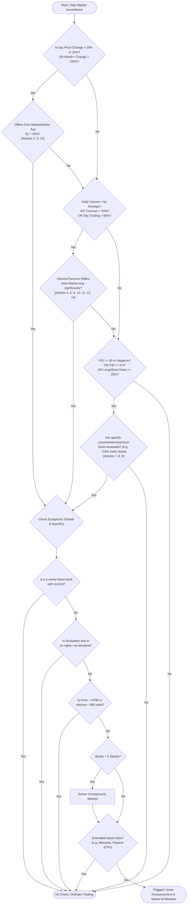

# Criteria to get in Monitoring List

## Global Exceptions (Safe Harbors)
These exceptions act as broad shields. If a security meets these conditions, they are exempt from the flag triggers of specific articles as noted:
* **Newly-listed Ordinary Shares:** Exempt during the period in which no price fluctuation limit is imposed. *(Applies to Articles: 2, 3, 4, 5, 6, 7, 8, 10, 11, 12, 13, 14)*
* **Non-trade Related Factors:** If a stock fluctuates due to ex-rights or ex-dividend factors, those data points are excluded. *(Applies to Articles: 2, 3, 4, 5, 6, 8, 9, 12)*
* **Already Flagged Recently:** If the stock recently received an announcement or disposition measure, a cool-down period or threshold hike might apply to prevent repeat immediate flagging. *(Applies to Articles: 3, 10, 11, 12, 14)*
* **Small Sectors (< 5 Securities):** Sector-comparisons are waived/exempt if the sector is too small. *(Applies to Articles: 2, 3, 4, 5, 6, 8)*
* **Derivatives & Non-Ordinary Shares:** Variables like volume/turnover rules usually don't apply to Warrants, ETNs, ETFs (active or passive), Convertible Bonds, and Preference Shares. *(Applies to: Articles 3, 4, 5, 6, 7, 10, 11, 13, 14 - Specific lists vary slightly per article)*
* **Low Absolute Values:** Certain articles are waived if trading is too small to definitively matter. (e.g., Turnover < 0.1%, Volume < 500 units, Price < NT$5, etc.)

---

## Article 2: Irregularity in the Cumulative Percentage of Increase or Decrease in the Closing Price
On a given day:
* Cumulative percentage of increase or decrease in the closing price for the most recent 6 business days >= 32%
    * **AND** differ for both market as a whole and for the same sector >= 20%
* Cumulative percentage of increase or decrease in the closing price for the most recent 6 business days >= 25%
    * **AND** differ for both market as a whole and for the same sector >= 20%
    * **AND** Closing price of initial vs final days of the 6 business days difference is >= NT$50.

*(Exceptions: Price < NT$5, Negative P/E or trading at 60x earning or above, Premium/Discount opposite standard direction <= 10%)*

---

## Article 3: Long-term Irregularity in Price
A security is flagged if its accumulated closing price change hits severe extremes over longer periods. Meets **one** of the following conditions:
* **30-day window:** Cumulative price change > 100% **AND** differs from market/sector averages by >= 85% **AND** the closing price for the day is above/below the opening reference price.
* **60-day window:** Cumulative price change > 130% **AND** differs from market/sector averages by >= 110% **AND** the closing price for the day is above/below the opening reference price.
* **90-day window:** Cumulative price change > 160% **AND** differs from market/sector averages by >= 135% **AND** the closing price for the day is above/below the opening reference price.

---

## Article 4: Price Irregularity Combined with Volume Increase
Targets short-term price spikes manipulated with extreme volume influxes. Meets **both**:
* **Price:** 6-day cumulative closing price change > 25% (**AND** differs from market/sector averages by >= 20%).
* **Volume Surge:** Trading volume for the given day is >= 5 times the average daily volume over the most recent 60 days, **AND** this increase differs from the market-wide average volume increase by a factor of 4 or more.

---

## Article 5: Price Irregularity with High Intraday Turnover
Targets heavily churned stocks experiencing anomalous price action. Meets **both**:
* **Price:** 6-day cumulative closing price change > 25% (**AND** differs from market/sector averages by >= 20%).
* **Turnover:** Intraday turnover rate >= 10%, **AND** it is greater than the market-wide average turnover by >= 5%.

*(Exceptions: Negative P/E or P/E >= 60x)*

---

## Article 6: Price Irregularity with Highly Concentrated Day Trading
Targets brokerages forcing price changes manually via day trading. Meets **both**:
* **Price:** 6-day cumulative closing price change > 25% (**AND** differs from market/sector averages by >= 20%).
* **Concentration:** Confirmed day trading purchases/sales at a *single* securities firm account for > 25% of total confirmed volume (up to a hard cap of 35% with branches) **AND** the volume reaches 500 trading units or more.

*(Exceptions: Negative P/E or P/E >= 60x)*

---

## Article 7: Irregular P/E, P/B, Turnover, and Trade Concentration
Targets fundamentally mispriced stocks that are being actively pushed. Meets **ALL FOUR**:
1. **P/E Ratio:** Negative or >= 60x, **AND** >= 2 times the weighted average P/E of the entire market.
2. **P/B Ratio:** Price-to-book ratio is >= 6.0, **AND** >= 2 times the weighted average P/B of the entire market.
3. **Turnover:** Intraday turnover >= 5% **AND** volume >= 3,000 units.
4. **Specific Extremes (Meets at least one):**
   * P/B is > 4 times the sector average.
   * A single securities firm accounts for >= 10% of total trade monetary value **AND** an absolute value >= NT$100 million.
   * A single investor accounts for >= 10% of total trade monetary value **AND** an absolute value >= NT$100 million.

---

## Article 8: Price Irregularity with Margin/Short Ratios
Targets potential short squeezes or extreme leverage situations. Meets **all three**:
* **Price:** 6-day cumulative closing price change > 25% (**AND** differs from market/sector averages by >= 20%).
* **High Leverage:** Long/short ratio on previous day >= 20%. Requires Margin utilization >= 25% **AND** Stock loan rate >= 15%.
* **Ratio Surge:** The long/short ratio on previous day is >= 4 times the lowest long/short ratio recorded in the past 6 days.

*(Exceptions: Negative P/E or P/E >= 60x, Long/short ratio on previous day < previous 2 days)*

---

## Article 9: TDR Premium/Discount Irregularities
Applies exclusively to Taiwan Depositary Receipts (TDRs). Meets **one** of:
* **Extreme Premium:** Premium > 80% **AND** closing price > opening reference price.
* **High Premium:** Premium > 30% **AND** closing price is the highest of the past 6 days.
* **High Discount:** Discount > 30% **AND** closing price is the lowest of the past 6 days.

---

## Article 10: Significant Volume Increase
Targets massive continuous volume anomalies independent of the price change percentage. Meets **both**:
* **6-Day Surge:** 6-day average volume is >= 5 times the 60-day average volume (**AND** differs from the market average increase by a factor of 4+).
* **1-Day Surge:** Daily volume is >= 5 times the 60-day average volume (**AND** differs from the market average increase by a factor of 4+).

*(Exceptions: Intraday turnover < 0.1%, or volume < 500 units, or total trading value < NT$30 million)*

---

## Article 11: High Cumulative Turnover Rate
Targets sustained, extreme churning of a security's available shares. Meets **both**:
* **6-Day Accumulation:** 6-day cumulative turnover rate > 50% (**AND** differs from the market average by 40%+).
* **1-Day Spike:** Intraday turnover rate >= 10% (**AND** differs from the market average by 5%+).

*(Exceptions: Confirmed transaction value on the given day is < NT$500 million)*

---

## Article 12: Extreme Initial to Final Day Price Difference
Targets absolutely massive raw monetary swings. Meets **one** of:
* **Extreme Highs:** The difference between the closing prices on the initial and final days of the most recent 6 business days is >= **NT$100** **AND** the closing price on the given day is also the *highest* of the most recent 6 business days. (If there is no closing price, it must exceed the opening reference price).
* **Extreme Lows:** The difference between the closing prices on the initial and final days of the most recent 6 business days is >= **NT$100** **AND** the closing price on the given day is also the *lowest* of the most recent 6 business days. (If there is no closing price, it must be lower than the opening reference price).

**The Bracket Rule Formulation (For Expensive Stocks):** 
If the closing price of the security on a given day is **NT$500 or more**, the baseline NT$100 requirement moves onto a sliding scale.
* For every NT$500 bracket in share price, an additional **NT$25** must be added to the NT$100 threshold limit.
* Example: For a NT$600 stock, the required 6-day price difference would be NT$125.

---

## Article 13: High Percentage of Borrowed Securities Sales
Targets potential orchestrated shorting campaigns via borrowed shares. Meets **both**:
* **Sustained Shorting:** 6-day borrowed securities sales volume >= 12% of total 6-day volume.
* **Current Surge:** Daily borrowed securities sales volume is >= 5 times the 60-day average.

*(Exceptions: Turnover <= 0.3%, overall volume <= 500 units, or borrowed sales <= 100 units)*

---

## Article 14: Extremely High Day Trading Volume
Targets securities overwhelmed almost entirely by day traders. Meets **both**:
* **6-day Average:** 6-day day trading volume accounts for > 60% of total 6-day volume.
* **Daily Average:** Daily day trading volume accounts for > 60% of total daily volume.

*(Exceptions: Turnover < 5%, Trading value < NT$500 million, or absolute day trading volume < 5,000 units)*

---

## Decision Tree for Stock Supervision

