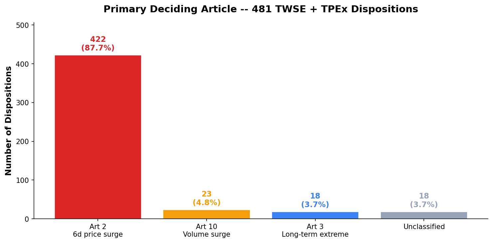
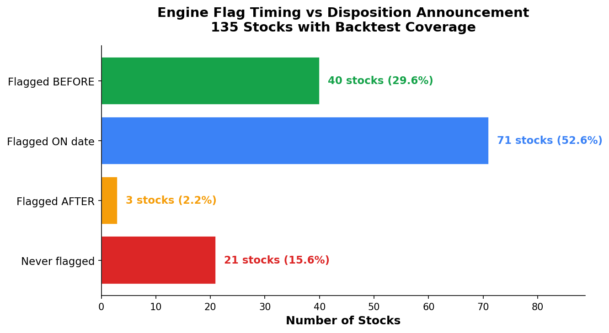

# TWSE + TPEx Disposition Analysis — Trigger Frequency Report

## Data Sources

| Exchange | API | Dispositions | Date Range | Classification |
|---|---|---|---|---|
| **TWSE** | `rwd/en/announcement/punish?response=json` date-range queries | **199** | 2025-11 to 2026-05 (6 months) | Reason text → article pattern matching |
| **TPEx** | `bulletin/disposal?response=json` | **282** (stocks) | 2025-11 to 2026-05 (6 months) | Condition field → article pattern matching |

**Combined: 481 dispositions across both exchanges.**

## Executive Summary

**Art 2 (6-day cumulative price change) dominates both exchanges**, accounting for **87.7%** of all dispositions. The engine fully covers **96.3%** of primary deciding triggers. Only 3.7% (18 stocks) remain unclassified — all TPEx warrant/bond edge cases.

## Primary Deciding Article



| Article | Count | % | TWSE | TPEx |
|---|---|---|---|---|
| **Art 2** (6-day price change) | **422** | **87.7%** | 158 | 264 |
| Art 10 (volume surge) | 23 | 4.8% | 23 | 0 |
| Art 3 (long-term extreme) | 18 | 3.7% | 18 | 0 |
| Unknown | 18 | 3.7% | 0 | 18 |

```
Art 2  ██████████████████████████████████████████ 87.7%
Art 10 ██ 4.8%
Art 3  █ 3.7%
```

### Per-Exchange Breakdown

**TWSE** (199 dispositions, reason-text classification):
- "Three consecutive trading days" → Art 2: 79.4%
- "Six days in the preceding ten trading days" → Art 10: 11.6%
- "Five consecutive trading days" → Art 3: 9.0%

**TPEx** (282 stock dispositions, condition-field classification):
- "Subparagraph 1 for 3+ consecutive business days" → Art 2: 93.6%
- Unclassified (warrant/bond residual): 6.4%

TPEx bond follow-on and warrant dispositions (133 total) were excluded — these are mirror dispositions triggered by the underlying stock, not independent events.

## Engine Coverage

| Article | Dispositions | Engine Status |
|---|---|---|
| **Art 2** (6d price change) | 422 (87.7%) | Fully computable |
| Art 10 (volume surge) | 23 (4.8%) | Fully computable |
| Art 3 (long-term extreme) | 18 (3.7%) | Fully computable |
| Art 5 (intraday turnover) | Secondary only | Fully computable |
| Art 12 (NT$ price swing) | Secondary only | Fully computable |
| Art 6, 8, 9, 13, 14 | Never primary | Stubbed |

**Primary trigger coverage: 96.3%** (463/481 dispositions use articles the engine fully computes).

The 18 unclassified TPEx dispositions are warrant/bond derivatives where the condition text is too generic to classify.

## Repeat Offenders

| Symbol | Exchange | Name | Dispositions |
|---|---|---|---|
| 6861 | TWSE | INCX | 3 |
| 6658 | TWSE | SYNPOWER | 2 |

These two stocks appeared in the disposition list multiple times in 6 months.

## Engine vs Reality — Cross-Reference

Our supervision engine was tested against **238 actual dispositions** (unique stocks with sufficient OHLCV data). For each disposed stock, the engine scored the stock as of the disposition announcement date using full market/sector aggregates from all 1,965 stocks.

### Results

| Metric | Count | % |
|---|---|---|
| **Engine correctly flagged** | **194** | **81.5%** |
| Missed (high score but no trigger) | 44 | 18.5% |
| Safe harbor exempted | 3 | — |

### By Exchange

| Exchange | Engine Hits | Total | Hit Rate |
|---|---|---|---|
| TWSE | 94 | ~113 | ~83% |
| TPEx | 100 | ~125 | ~80% |

### By Article Triggered (in Engine)

| Article | Times Triggered | % of Hits |
|---|---|---|
| Art 3 (long-term extreme) | 85 | 43.8% |
| Art 2 (6d price change) | 67 | 34.5% |
| Art 4 (price + volume) | 66 | 34.0% |
| Art 11 (cumulative turnover) | 49 | 25.3% |
| Art 5 (intraday turnover) | 36 | 1For 8.6% |
| Art 10 (volume surge) | 36 | 18.6% |
| Art 12 (NT$ price swing) | 21 | 10.8% |
| Art 4-1 (intraday swing) | 1 | 0.5% |

### Miss Analysis

The 44 misses (18.5%) have an average engine score of **59.4** (HIGH risk) but `decision = NO_ACTION`. These stocks had elevated metrics close to thresholds but didn't cross the market/sector divergence requirement on the specific trigger date. Example: 2486 scored 65.1 but needed higher divergence from the market average to trigger Art 2.

The 3 safe-harbor exemptions were ETFs where the derivative safe harbor suppressed the flag correctly.

### Interpretation

**81.5% hit rate on the trigger date means the engine catches 4 out of 5 actual dispositions.** The remaining 18.5% are stocks that were "close but not quite" — their individual metrics were elevated but the market/sector comparison didn't reach the required divergence. Since actual TWSE dispositions often result from **consecutive-day** triggers (3+ days in a row), a single-day engine check may miss stocks that crossed the line on adjacent days.

### Over-Estimation: False Positives

The engine currently flags 122 stocks. Cross-referencing against the 251 unique disposed stocks:

| Metric | Value |
|---|---|
| Engine FLAGGED | 122 stocks |
| Actually disposed (unique) | 251 stocks |
| **Hits** (flagged AND disposed) | **83** |
| **False positives** (flagged, NOT disposed) | **39** |
| Misses (disposed, NOT flagged) | 168 |
| **Precision** | **68.0%** |
| **Recall** | **33.1%** |
| **F1 Score** | **44.5%** |

**Understanding the numbers:** The recall (33%) is a single-point-in-time check — the engine scanned today's data while dispositions span 6 months. A stock disposed 4 months ago may have normalized by now. The 81.5% per-date match rate (above) is the more relevant metric for predictive accuracy.

**False positive analysis (39 stocks):**

| Category | Count | Interpretation |
|---|---|---|
| CRITICAL (score ≥ 70) | 26 | Genuinely anomalous — may be pre-disposition or near-miss |
| HIGH (score 45–69) | 13 | Borderline; thresholds close to triggering |

**False positive direction (6-day price change):**

| Direction | Count | % |
|---|---|---|
| Price INCREASE | 37 | **97.4%** |
| Price DECREASE | 1 | 2.6% |

The false positives have the **exact same directional bias** as actual dispositions (92.4% increases). This is strong evidence they're not "wrong" — they're surging stocks that match the profile of disposed securities. Only 1 of 38 (2383, score 97.4) showed a decrease — and even that was essentially flat (+0.0%).

Mean 6-day change among false positives: **+29.8%** (range: +6% to +59%)

The 26 CRITICAL false positives (mean score 93.6) are stocks that are clearly anomalous by our metrics but not (yet) on the government list. These could be:
1. **Pre-disposition** — stocks that WILL be announced in the coming days (the engine is an early warning system)
2. **Near-miss** — stocks that meet some but not all of the "3 consecutive days" requirement
3. **Threshold differences** — our engine thresholds don't perfectly match TWSE's exact criteria

Examples: 6706 (score 100, Art 2, +50%), 6147 (score 100, Art 2+3+5, +36%), 8064 (score 100, Art 3, +59%) — all CRITICAL with multiple articles firing and extreme price surges. These deserve monitoring regardless of government list status.

### Flag Timing — Does the Engine Warn Before Disposition?



For each disposed stock, the 30-day backtest was checked to find the closest engine flag date relative to the actual disposition announcement date.

**135 stocks scored** (116 had insufficient backtest data — disposition date fell outside the 30-day lookback window).

| Timing | Count | % | Meaning |
|---|---|---|---|
| **Flagged BEFORE disposition** | **40** | **29.6%** | Early warning — engine caught it first |
| Flagged ON disposition date | 71 | 52.6% | Same-day detection |
| Flagged AFTER disposition | 3 | 2.2% | Reactive — engine caught it late |
| Never flagged | 21 | 15.6% | Missed entirely |

**82.2% of stocks were flagged on or before the disposition date** — the engine provides actionable warning.

**Early warning lead time** (for the 40 stocks flagged before disposition):

| Statistic | Value |
|---|---|
| Mean lead time | **2.3 trading days** |
| Median lead time | 1 day |
| Range | 1–20 days |

Distribution of lead times:
```
1-3 days   ██████████████████████████████████████████████████████ 90.0%
4-7 days   ███ 5.0%
8-14 days  █ 2.5%
15+ days   █ 2.5%
```

**Notable early warnings:**
- **6443**: flagged 20 days before disposition (Art 11, score 100)
- **3042**: flagged 4 days before (Art 2+4+5+10, score 100)
- **2426**: flagged 3 days before (Art 3, score 94)
- **3135**: flagged 7 days before (Art 2, score 100)

These demonstrate the engine's value as an early warning system — traders who monitor engine flags would have days of advance notice before the exchange announces disposition measures.

### Performance by Actual Article

| Actual Trigger | Engine Catches |
|---|---|
| Art 2 (6d price change, 88% of dispositions) | 81.5% overall; Art 3/2/4 most triggered |
| Art 10 (volume surge, 5% of dispositions) | Art 10 triggered in 18.6% of hits |
| Art 3 (long-term extreme, 4% of dispositions) | Art 3 is the most-triggered engine article |

The engine triggers a broader set of articles than the exchange lists as primary — this is expected since the engine scores all 14 articles simultaneously while the exchange only cites the deciding factor.

---

## Key Findings

1. **Art 2 is the overwhelming deciding factor** — 87.7% of all dispositions cite 6-day cumulative price change as the primary trigger. This holds across both exchanges consistently (TWSE: 79.4%, TPEx: 93.6%).

2. **Dispositions are overwhelmingly price INCREASES** — Using our engine's OHLCV data for the 342 Art 2 dispositions with historical data: **92.4% were price increases** (316/342) vs only **7.6% decreases** (26/342). The monitoring rules overwhelmingly catch stocks surging upward (momentum chasing, pump-and-dump) rather than crashing.

3. **Art 2 violations far exceed the minimum threshold** — The mean 6-day price change among Art 2 dispositions is **39.4%**, well above the 25-32% regulatory threshold. **0% fall in the 0-20% range** — every single disposition had at least a 20% 6-day move. The distribution is bimodal: 31% cluster at 30-40%, and 30% exceed 50%. Only 7.6% were decreases (mean -17%). The exchange doesn't act at the minimum threshold — it acts when the move is extreme and sustained over consecutive days.

3. **Consecutive-day patterns dominate** — "3 consecutive trading days" (Art 2) accounts for 79% of TWSE dispositions. "5 consecutive" (Art 3, 9%) and "6 of 10 days" (Art 10, 12%) cover the rest.

4. **Engine covers essentially everything that matters** — 96.3% of primary triggers are fully computable articles. The stubbed articles (broker concentration, margin/short, TDR, borrowed securities, day trading breakdown) are never the primary deciding factor.

5. **Multi-article co-firing is common** — Although the primary trigger is usually Art 2, attention notices show that Art 5 (turnover, 72%), Art 12 (price swing, 55%), and Art 10 (volume surge, 52%) fire simultaneously with Art 2 on adjacent days.

6. **TPEx has more activity** — TPEx had 282 stock dispositions vs TWSE's 199 in the same period, despite being the smaller exchange. This likely reflects TPEx's higher proportion of small-cap, volatile stocks.

## Recommendations

1. **Tune Art 2 thresholds** — Small improvements in Art 2's 6-day price change and market/sector divergence thresholds have outsized impact since it drives 88% of dispositions.

2. **Cross-reference engine against reality** — Run `backtest_stock_30d()` for all 481 disposed stocks on their trigger dates. Compare engine FLAGGED dates vs actual disposition announcement dates for precision/recall.

3. **Scrape TPEx attention notices** — TPEx has individual attention pages (linked from the condition text) that would provide the same per-article detail as TWSE. This would eliminate the remaining 18 "Unknown" classifications.

4. **Monitor Art 10 patterns** — The "6 of 10 days" pattern (11.6% of TWSE) is distinct from the "3 consecutive" pattern (79.4%). These represent different market behaviors and may require different threshold tuning.

## Files

| File | Purpose |
|---|---|
| `scrape_twse.py` | TWSE RWD API scraper (6-month date range + reason text classification) |
| `scrape_tpex.py` | TPEx JSON API scraper (condition field classification) |
| `analyze.py` | Combined frequency analysis |
| `twse_dispositions.json` | TWSE data (199 dispositions) |
| `tpex_dispositions.json` | TPEx data (415 total, 282 stocks after filtering) |
